# image to voxel  
## Цель работы  
Разработать модель глубокого обучения, способную восстанавливать 3D-геометрию объектов по их 2D-изображениям. На вход модель принимает изображение, на выходе генерирует 3D-модель в одном из представлений: облако точек, воксельная сетка или полигональная mesh (STL-формат).  
  

## Входные даннные  
Нам дан датасет, состоящий из изображений деталей и соответствующих им .stl моделей этих деталей.  

## Возможные подходы и архитектуры нейронных сетей   

### Pixel2Mesh  
Архитектура преобразует 2D-изображение в 3D-меш, последовательно деформируя начальный эллипсоид с использованием графовых сверточных сетей (GCN). Изображение обрабатывается предобученным энкодером (VGG16 или ResNet50), извлекающим признаки, которые проецируются на вершины меша через слой GProjection. Процесс включает три этапа: деформацию базового эллипсоида, апсемплинг вершин и финальное уточнение.  
  
**Преимущества:**  
- Генерирует готовые к использованию меш-модели (в отличие вокселей или облаков точек).  
- Поддерживает прогрессивное уточнение формы.  

**Недостатки:**  
- Требует большого объема данных для обучения.  
- Высокая вычислительная нагрузка.  
  
### 3D-R2N2 (Recursive Reconstruction Neural Network)  
Рекуррентная нейросеть, восстанавливающая 3D-воксели из одного или нескольких 2D-изображений. Использует LSTM-слои для последовательного обновления скрытых состояний, что позволяет уточнять форму объекта на каждом шаге.  

**Преимущества:**  
- Поддерживает мульти-вью синтез для повышения точности.  
  
**Недостатки:**  
- Требует больших вычислительных ресурсов.  
  
### Encoder-Decoder 3D (Выбранная в работе)
Энкодер извлекает признаки из 2D-изображения, а декодер преобразует их в 3D-воксели через серию транспонированных сверток.
  
**Преимущества:**  
- Простота реализации и интерпретации.  
- Эффективен при ограниченных данных.  
  
**Недостатки:**  
- Ограниченная детализация из-за дискретизации вокселей.  
- Проблемы с восстановлением текстур и тонких структур.  
  

## pixel2mesh  
Сначала попробовала использовать pixel 2 mesh сеть, но оказалось, что данных для тренировки слшком мало для столь сложной архитектуры, а оценить, движемся ли в правильную сторону, тяжело.  
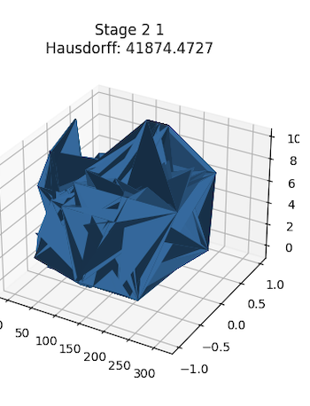  
  
## Выбранная архитектура  
Используется Encoder - Decoder 3d.  
`Encoder` использует предобученную ResNet50 как основу. Его задача - переходить из 2D изображения в пространство признаков.  
`Decoder` переводит пространство признаков, полученное от энкодера, в 3D воксели.  
   
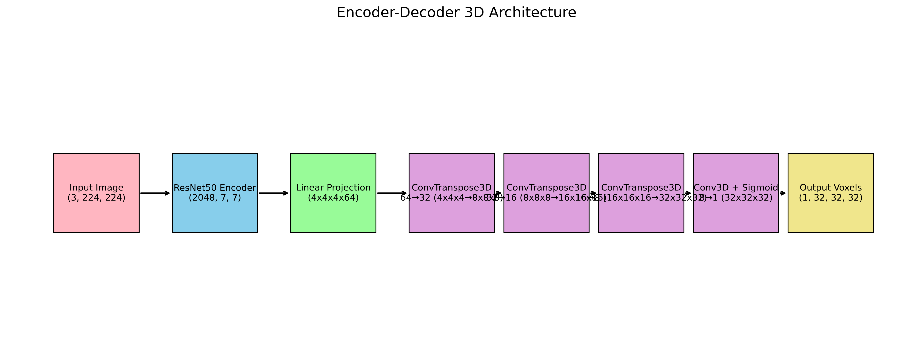  
  
## Предобработка данных  
- **Преобразование модели в воксели** – мы используем пакет `open3d` для работы с `.stl` моделями и перевода их в вид воксельной сетки.  
- **Предобработка изображений** – чтобы упростить работу модели, перед входом мы сжимаем изображение, а также применяем `canny edge` фильтр, чтобы подсветить грани.  
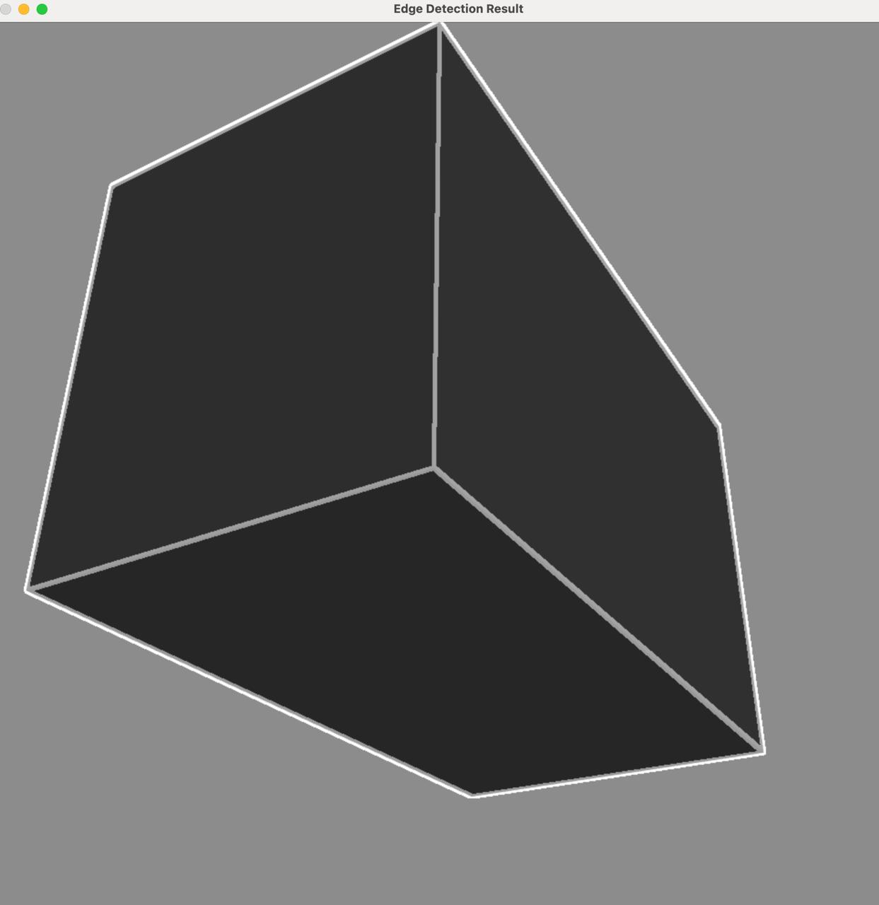
  
## Тренировка модели  
Модель тренировалась 35 эпох, до момента, когда начиналось переобучение и `val_loss` начинал расти(изначально тренировали 100 эпох, потом уменьшили количество). Не стали останавливать тренировку после выхода `val_loss` на плато тк при просмотре примеров применения видно, что способность повторять части фигур(окружность, треугольник) все-таки немного улучшалась.  
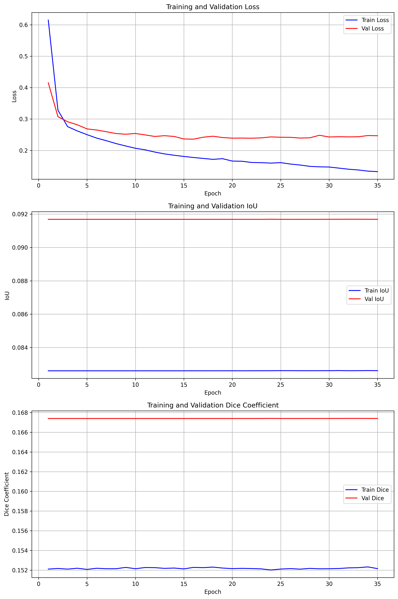  
  
Использовались метрики: `Intersection over Union (IoU)` и `Dice Coefficient`

## Примеры работы модели  
| Image |
|-------|
| 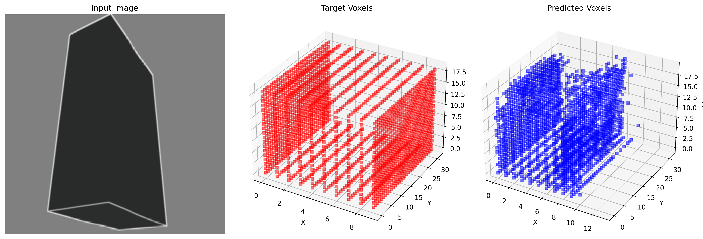 |
| 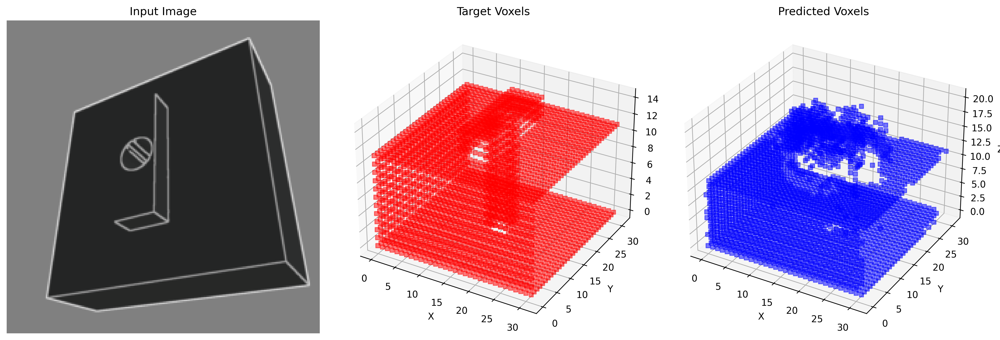 |
| 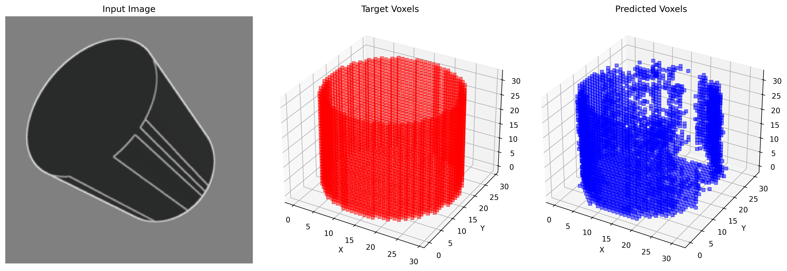 |
| 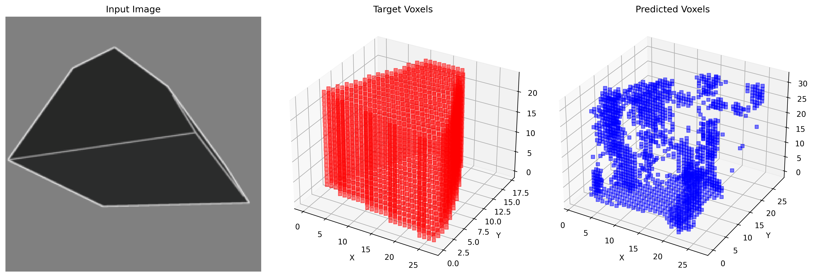 |
| 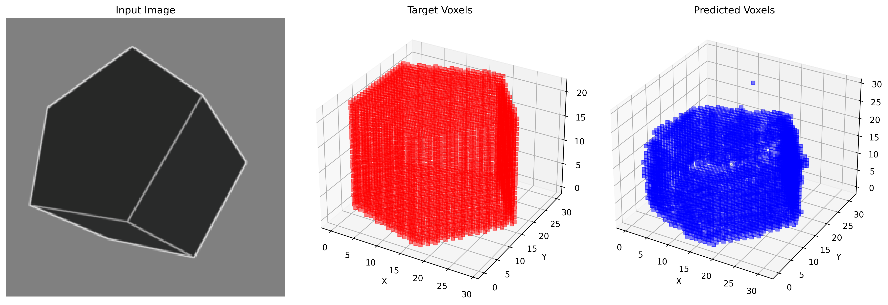 |
| 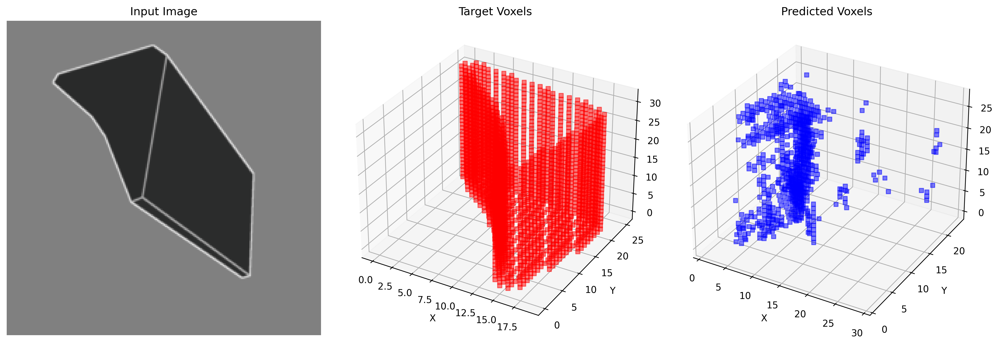 |
| 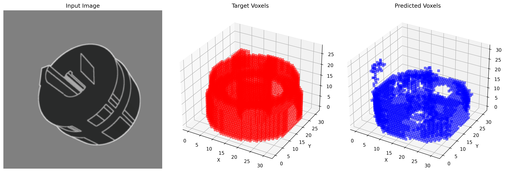 |   
  
## Возможности для улучшения модели  
Кажется, что основная преграда в достижении хорошего качества модели – это недостаток данных для тренировки. Возможными улучшениями будут как использовать больший датасет, так и попробовать аугментировать текущие данные, делая рендеры моделей с разных сторон.  
  
## Про параметрические модели  
Были найдены несколько статей, посвященных созданию параметрических моделей по изображению.  
  
### DeepCAD (Авторегрессионные RNN/Трансформеры)  
> https://arxiv.org/pdf/2105.09492  
Генерирует последовательность CAD-операций (экструзия, вращение, вырез) с параметрами (например, длина, угол, радиус) на основе входного изображения. Модель предсказывает каждую операцию шаг за шагом, используя RNN или трансформеры, имитируя процесс инженерного проектирования.  
  
- Сохраняет полную параметризацию (операции и их параметры редактируемы в CAD-среде).
- Поддерживает иерархические зависимости (например, отверстия зависят от базовой экструзии).

### BRepNet (Графовые нейронные сети)  
> https://arxiv.org/pdf/2402.17695v1
Обрабатывает Boundary Representation (B-Rep – "скетч-рендер") структуры CAD-моделей, анализируя вершины, рёбра, грани и их связи. Использует графовые свертки для предсказания параметров (например, радиус скругления) на основе 2D-изображения или эскиза.

- Работает напрямую с нативными CAD-форматами (STEP, IGES).
- Восстанавливает топологические ограничения (например, параллельность граней).
- Высокая сложность обработки графов с тысячами элементов.

### Sketch2CAD (CNN + RL)  
>https://arxiv.org/pdf/2009.04927  
Преобразует эскиз (например, технический чертёж) в параметрическую модель через два этапа:  
CNN выделяет геометрические примитивы (окружности, линии).  
Рекуррентная сеть с RL выбирает CAD-операции и параметры, максимизируя "правильность" модели.  
- Интегрируется с CAD-API (например, OpenCASCADE) для автоматического создания моделей.
- Эффективен для деталей с явными геометрическими примитивами.
- Не подходит для сложных органических форм.

 
